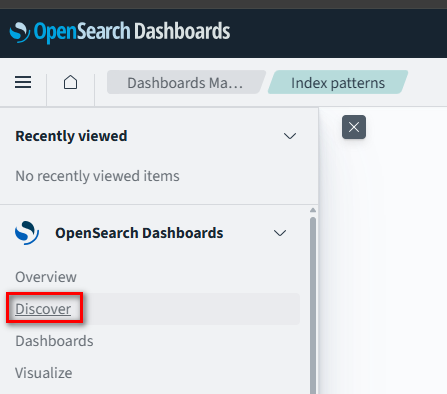
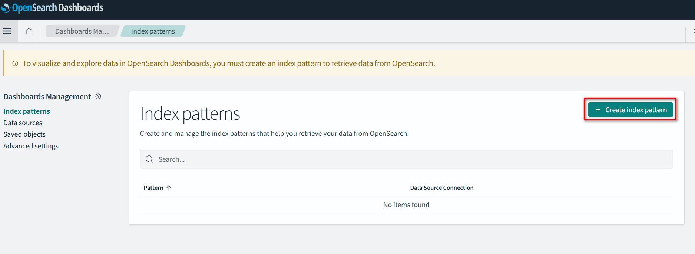
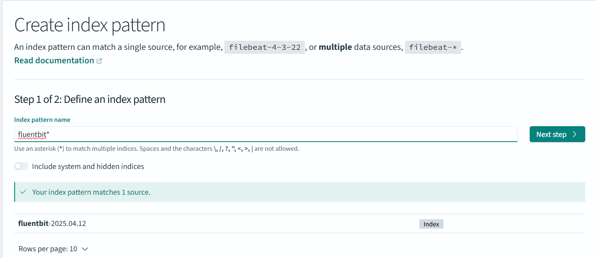
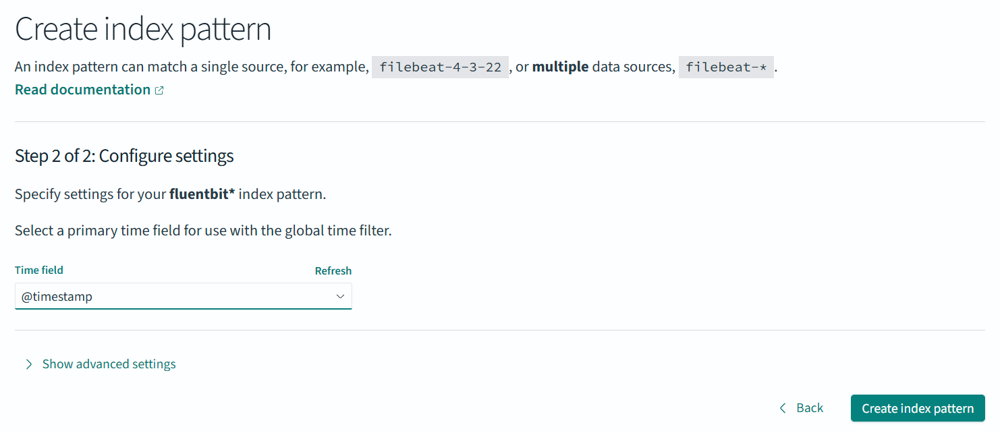
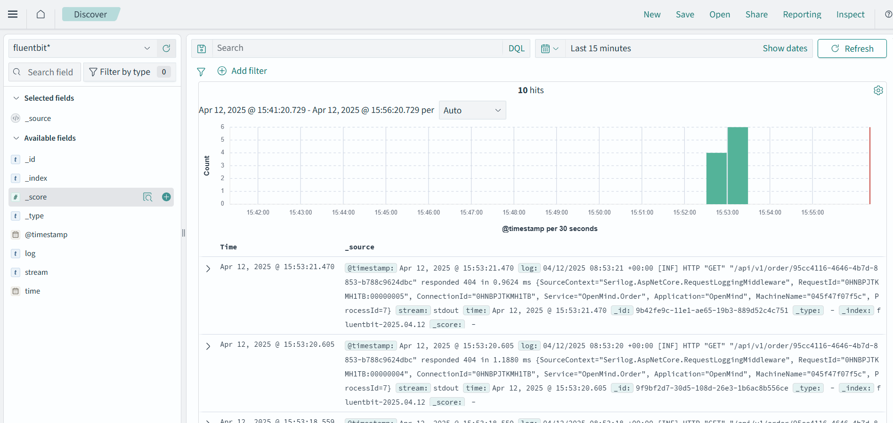
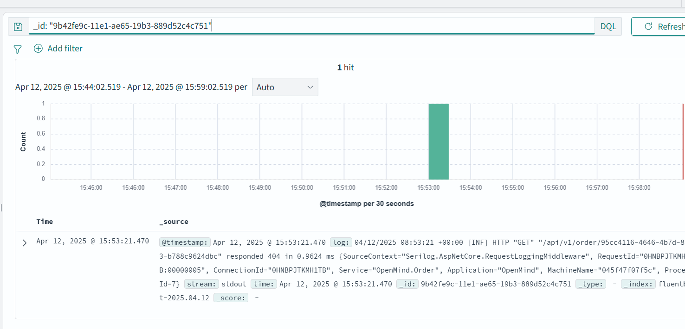

## Docker compose
Start all services:
```bash
docker-compose up -d
```
APIs endpoints:   
- OrderAPI: `http://localhost:8080/api/v1/orders`

## Fluent Bit
Fluent Bit is used to collect logs from the application and send them OpenSearch.

Current settings are configured to collect logs from OrderAPI container. 
Configuration file is located in `config/fluent-bit.conf`.
- **Windows**: 
  - /var/lib/docker/containers/*/*.log 
  - Sample location: \\wsl.localhost\docker-desktop\mnt\docker-desktop-disk\data\docker\containers\ba9771625e563346627a7236137ec6aec5ed580f1ae8f15535eba5dc539ee837.log
- **Mac**: 
  - /Users/tungle/Library/Containers/com.docker.docker/Data/log/vm/*.log
  - Need to grant permission to access the folder because of Library is protected by MacOS

Output config is OpenSearch:
```yaml
[OUTPUT]
    Name              es
    Match             *
    Host              opensearch
    Port              9200
    Index             fluentbit
    Logstash_Format   On
    Logstash_Prefix   fluentbit
    Generate_ID       On
    Replace_Dots      On
    Trace_Output      On
    Trace_Error       On
    Suppress_Type_Name On
```
The index is created in OpenSearch with the name `fluentbit-YYYY.MM.DD`.

## OpenSearch and OpenSearch Dashboards
Dashboard URL: `http://localhost:5601/`

Create index pattern:






Back to Discover page and query:




